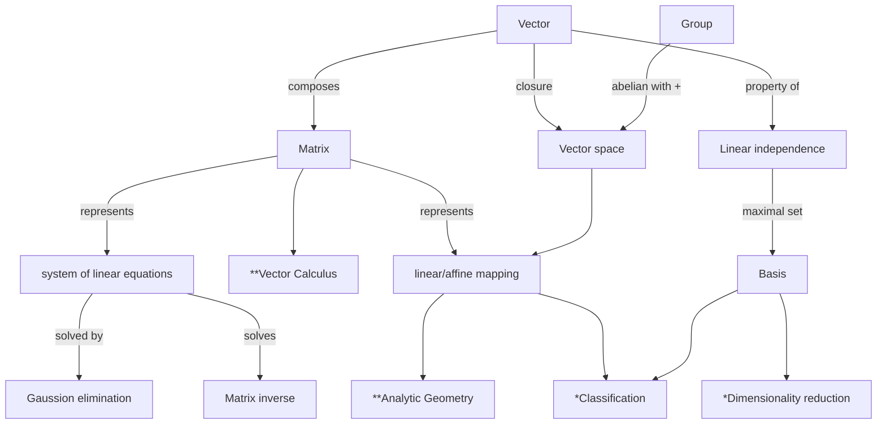

# Linear Algebra

linear algebra studies vectors and rules that manipulates vectors. vector is a much general concept. its a special object that can be,
> added together and multiplied by scalars to produce another object of the same kind

- geometrical vectors $\vec{x}+\vec{y}=\vec{z}$ and $\lambda{\vec{x}},\lambda\in{\mathbb{R}}$
- polynomials vectors
- audio signals (vectors)
- elements of $\mathbb{R}^{n}$, which is the concept focused here $a=\begin{bmatrix} 1 \\ 2 \\ 3 \end{bmatrix}\in{\mathbb{R}^{3}}$

the book will be only discussing on finite-dimensional vector spaces, in which case there is a 1:1 correspondence between any kind of vector and $\mathbb{R}$. geometric intuition and array based algorithms help to understand linear algebra.

> what is the set of all things that can result from my proposed operations? - closure (key math concept)

in vectors context, what is the set of vector that can result by starting with small set of vectors and adding/scaling them? the results is __vector space__. vector space and its properties is the foundation of machine learning.



> note, ** refers to math chapters and * refers to ML algorithm chapters

## System of Linear Equations

Many problems can be formulated as systems of linear equations and linear algebra provides us the tool for solving them.

Example 2.1  
A company produces product $N_1$,...,$N_n$ for which resources $R_1$,...,$R_m$ are required. To produce a unit of product $N_j$, $a_{i,j}$ units of resources $R_i$ where $i=1$,...$m$ and $j=1$,...,$n$. the objective is to find an optimal production plan, i.e. a plan of how many units $x_j$ of product $N_j$ should be produced if a total of $b_i$ units of resource $R_i$ are available and no resources are left over. if we produce $x_1$,...,$x_n$ units of the corresponding products, we need a total of $a_{i1}x_1+...+a_{in}x_n$ many units of resource. An optimal production plan $(x_1,...,x_n)\in{\mathbb{R}^n}$, therefore has to satisfy the following system of equations:

$$
\begin{matrix}
    a_{i1}x_1+&...+a_{1n}x_n=b_1 \\
    &\vdots \\
    a_{m1}x_1+&...+a_{mn}x_n=b_m
\end{matrix}
\text{where }a_{ij}\in{\mathbb{R}}\text{ and }b_i\in{\mathbb{R}}
$$

by substituting random values to $a_{i,j}$ a solution set that contains infinite many solution can be obtained.

> hint: set one of the x into a free variable

in general for a real value system of linear equation, zero, exactly one or infinite many solution is obtained. linear regression solves a version of example 2.1 when the system of linear equations cannot be solved.

### a geometric interpretation

in the system of linear equation with two variables $x_1,x_2$, each linear equation defines a line in the plane $x_1x_2$. since a solution to a system of linear equation must satisfy all equation simultaneously the solution set is the intersection of the lines. it can be a line, a point or empty.

for a systemic approach to solve system of linear equation, compact notation is used.

$$
x_1\begin{bmatrix}a_{11} \\ \vdots \\ a_{m1} \end{bmatrix}+ \dots + x_n\begin{bmatrix}a_{1n} \\ \vdots \\ a_{mn}\end{bmatrix}=\begin{bmatrix}b_1 \\ \vdots \\ b_m \end{bmatrix} \hArr \begin{bmatrix}a_{11} & \dots & a_{1n} \\ \vdots & & \vdots \\ a_{m1} & \dots & a_{mn} \end{bmatrix} \begin{bmatrix}x_1 \\ \vdots \\ x_n \end{bmatrix} = \begin{bmatrix}b_1 \\ \vdots \\ b_m \end{bmatrix}
$$

## Matrices

used widely in linear algebra to represents systems of linear equation compactly and represent linear functions/mappings.

Definition 2.1  

$$
A = \begin{bmatrix}
    a_{11}&a_{12}&\dots&a_{1n} \\
    \vdots&\vdots& &\vdots \\
    a_{m1}&a_{m2}&\dots&a_{mn}
\end{bmatrix}, a_{ij} \in \mathbb{R}
$$

$\mathbb{R}^{m\times{n}}$ is the set of all real-valued $m\times{n}$ matrices. $A$ in definition 2.1 can be equivalently represented as $a\in\mathbb{R}^{mn}$ by stacking all $n$ columns into a long vector.

### matrix addition and multiplication

sum of two matrices $A$ and $B$ requires that $A, B\in\mathbb{R}^{m\times{n}}$ such that $a_{ij} + b_{ij}$ is possible. matrix multiplication or dot prodoct requires that $A\in\mathbb{R}^{m\times{n}}$ and $B\in\mathbb{R}^{n\times{k}}$, such that $C=AB\in\mathbb{R}^{m\times{k}}$ where $c_{ij}=\sum^{n}_{l=1}{a_{il}b_{lj}}, i=1,\dots,m,\;j=1,\dots,k$. a $\cdot$ is used to be explicit for matrix multiplication. elementwise multiplication is call hadamard product.

```python
a = np.einsum('il,lj', A, B)  # example of dot product
```

Definition 2.2  
$I_n$ identity matrix where $i_{mm},\,m=1,\dots,n$ is $1$ and the rest is $0$.

with that below are some propeties of matrices.

- associativity $\forall{A}\in\mathbb{R}^{m\times{n}},B\in\mathbb{R}^{n\times{p}},C\in\mathbb{R}^{p\times{q}}:(AB)C=A(BC)$
- distributivity $\forall{A,B}\in\mathbb{R}^{m\times{n}},{C,D}\in\mathbb{R}^{n\times{p}}:(A+B)C=AC+BC,\;A(C+D)=AC+AD$
- multiplication with $I$, $\forall{A}\in\mathbb{R}^{m\times{n}}:I_mA=AI_n=A$

### inverse and transpose

Definition 2.3

consider a square matrix $A\in\mathbb{R}^{n\times{n}}$ and matrix $B\in\mathbb{R}^{n\times{n}}$ such that $AB=I_n=BA$. $B$ is called the inverse of $A$ and denoted as $A^{-1}$. not all matrix has an inverse matrix of itself, those who have are called invertible/nonsinglar. and when matrix inverse exists, it is unique. by solving system of linear equation we get a general way of computing inverse matrix.  

Definition 2.4  

for $A\in\mathbb{R}^{m\times{n}}$ and matrix $B\in\mathbb{R}^{n\times{m}}$ with $b_{ij}=a_{ji}$, $B=A^{T}$.

with that below are some properties of matrices.

- $AA^{-1}=I=A^{-1}A$
- $(AB)^{-1}=B^{-1}A^{-1}$
- $(A+B)^{-1}\neq{A^{-1}+B^{-1}}$
- $(A^{T})^{T}=A$
- $(A+B)^{T}={A^{T}+B^{T}}$
- $(AB)^{T}=B^{T}A^{T}$

Definition 2.5  

$A\in\mathbb{R}^{m\times{n}}$ is symmetric if $A=A^{T}$. only square matrix can be symmetric. symmetric matrix $A$ if invertible, then so is $A^{T}$, thus $(A^{-1})^{T}=(A^{T})^{-1}=:A^{-T}$

### multiplication by a scalar

let $\lambda\in\mathbb{R}$ and $A\in\mathbb{R}^{m\times{n}}$, then $\lambda A=K,\,K_{ij}=\lambda a_{ij}$. and let $\phi\in\mathbb{R}$

with that below are some properties of matrices

- associativity
    - $(\lambda\phi)A=\lambda(\phi A)$
    - $\lambda(AB)=(\lambda A)B=A(\lambda B)$
    - $(\lambda C)^{T}=\lambda C^{T}\,\because\,\lambda=\lambda^{T}$
- distributivity
    - $(\lambda+\phi)A=\lambda A + \phi A$
    - $\lambda(A+B)=\lambda A+\lambda B$

> note when we write compact representation of system of linear equation each x scales a column

## Solving System of Linear Equations

this section will focus on solving system of linear equation and provide an algorithm for finding inverse of matrix.

### particular and general solution

$$
\begin{bmatrix}
    1 & 0 & 8 & -4\\
    0 & 1 & 2 & 12
\end{bmatrix}
\begin{bmatrix}
    x_1 \\ x_2 \\ x_3 \\ x_4
\end{bmatrix}
=
\begin{bmatrix}
    42\\
    8
\end{bmatrix}
$$

first ensure that the matrix is in an upper triangle matrix and be smart with zero and one's placement. immediately we get $\begin{bmatrix}42 & 8 & 0 & 0\end{bmatrix}^T$ as one particular solution. from there work on the subsequent particular solution with the 3rd and 4th column. thus,

$$
0 = 8c_1 + 2c_2 - c_3 + 0c_4,\; 0 = -4c_1 + 12c_2 + 0c_3 - c_4
$$

and from there obtain general solution,

$$
x\in\mathbb{R}^4:x=
\begin{bmatrix}
    42\\
    8\\
    0\\
    0
\end{bmatrix} + \lambda_1
\begin{bmatrix}
    8\\
    2\\
    -1\\
    0 
\end{bmatrix} + \lambda_2
\begin{bmatrix}
    -4\\
    12\\
    0\\
    -1
\end{bmatrix},\;\lambda_1,\lambda_2\in\mathbb{R}
$$

or basically

1. transform matrix to upper triangular matrix using Gaussian elimination
2. find particular solution
3. find all solution for $Ax=0$
4. combine all solution into a general solution

### elementary transformations

key to step 1 in solving SoLE with Gaussian elemination is elementary transformations. elementary transformation keeps the solution same but transform the equation system into its simpler form, also known as row echelon form.

- exchange rows
- multiplication of rows with constant which $\in\mathbb{R}\setminus\{0\}$
- additions of rows

REF is defined such that

- all rows that contain only zero are at the bottom
- all rows that contain at least one nonzero element are on top of those contain only zeros
- looking a nonzero rows, first nonzero number from the left is always strictly to the right of the pivot of the row above it.

pivots in REF are called _basic variables_ and the rest are called _free variables_.

### RREF

difference with REF is that besides complying to REF, RREF's pivot has to be 1 and the pivot is the only nonzero entry in its column. the process of performing elementary transformation to obtain RREF from SLE is called Gaussian Elimination.

once obtained RREF, its easier to solve $Ax=0$ by taking each non-pivot column and figure out how to turn these non-pivot column into zero.

$$
from
\begin{bmatrix}
    1 & 3 & 0 & 0 & 3\\
    0 & 0 & 1 & 0 & 9\\
    0 & 0 & 0 & 1 & -4
\end{bmatrix}\;obtain\;
\lambda_1\begin{bmatrix}3\\-1\\0\\0\\0\end{bmatrix}+
\lambda_2\begin{bmatrix}3\\0\\9\\-4\\-1\end{bmatrix}
$$

### minus one trick

assume $A$ is in RREF form without rows that only contains zeros and satisfies $A\in{\mathbb{R}^{k\times{n}}}$. by extending the matrix to an $n\times{n}$ matrix $\tilde{A}$ by adding $n-k$ rows of the form $\begin{bmatrix} 0 & ... & -1 & 0 & ...& 0 \end{bmatrix}$ to ensure the diagonal of the augmented matrix contains only 1 or -1. with such the columns of $\tilde{A}$ are pivots that are solutions of the homogeneous equation system $Ax=0$. in other words these columns forms the basis of the solution space of $Ax=0$.

> homogeneous equation system refers to system of linear equations where all constants terms are zero

### calculating the inverse

the inverse of $A\in{\mathbb{R}^{n\times{n}}}$ $A^-1$ can be found by solving $AX=I_n$ where $X$ in this case is $A^-1$. this can be done by gaussian elimination.

$$
\begin{bmatrix}
    A|I_n
\end{bmatrix}
\rArr
\begin{bmatrix}
    I_n|A^{-1}
\end{bmatrix}
$$

### algorithms for solving a SoLE

up until previous section the assumption is there exists a solution. should there be no solution, approximation of solutions is needed and it can be achieved through linear regression (in later chapter). in special cases when $A^{-1}$ can be determined, solution of $Ax=b$ is given as $x = A^{-1}b$. however this is only possible if $A$ is a square matrix and invertible. otherwise, under mild assumptions of $A$ having linearly independent columns,

$$
Ax=b \lrArr A^{T}Ax=A^{T}b \lrArr x = (A^{T}A)^{-1}A^{T}b
$$

using Moore-Penrose pseudo inverse $(A^{T}A)^{-1}A^{T}$ to solve $Ax=b$ similar to minimum norm least-squares solution. the downside of such approach is it requires lots of computations and not having a good numerical precisions.

gaussian elimination is intuitive and constructive way of solving SoLE however it is impractical to use it for large matrices. SoLE in practice are solved indirectly by stationary iterative methods,

- Richardson method
- Jacobi method
- GauB-sidel method

or the successive over-relaxation methods,

- conjugate gradients
- generalized minimal residual
- biconjugate gradients

let $x_*$ be a solution of $Ax=b$ and the key idea of iterative merhods is basically $x^{(k+1)}=Cx^{k}+d$ which minimize residual error $||x^{(k+1)}-x_*||$ in every iteration to converge to $x_*$

## Vector Spaces

### Groups

group besides provide a framework for set operations, is also heavily used in cryptography, coding theory and graphics.

consider a set of $G$ and an operation $\bigotimes:G\times{G}\rarr{G}$ defined on $G$, then $G:=(G, \bigotimes)$ is called a group iif the following hold

- closure of $G$ under $\bigotimes:\forall{x,y}\in{G}:x\bigotimes{y}\in{G}$
- Associativity $\forall{x,y,z}\in{G}:(x\bigotimes{y})\bigotimes{z}=x\bigotimes(y\bigotimes{z})$
- neutral element $\exist{\mathbb{e}}\in{G}\forall{x}\in{G}:x\bigotimes{\mathbb{e}}=x\And{\mathbb{e}\bigotimes{x}=x}$
- inverse element $\forall{x}\in{G}\exist{y}\in{G}:x\bigotimes{y}=e\And{y\bigotimes{x}=e}$, which inverse is denoted as $x^{-1}$

> inverse element is defined with respect to the operation and does not mean 1/x

if it too satisfy $\forall{x,y}\in{G}:x\bigotimes{y}=y\bigotimes{x}$ then $G=(G, \bigotimes)$ is an Abelian group (commutative).

> no helpful tricks besides know the definition well...

for $(\mathbb{R}^{n\times{n}}, \cdot)$ closure and associativity is covered by the matrix definition. natural element is $I_n$ w.r.t $\mathbb{R}^{n\times{n}}$ and inverse element is satisfied if for all elements in $\mathbb{R}$ are invertible. this is called a general linear group, $GL(n,\mathbb{R})$

### vector spaces

a real value vector space $V=(V,+,\cdot)$ is a set of $V$ with two operation,

- $+:V\times{V\rarr{V}}$
- $\cdot:\mathbb{R}\times{V\rarr{V}}$

where

- $(V,+)$ is an abelian group
- Distributivity
  - $\forall{\lambda}\in{\mathbb{R}},x,y,\in{V}:\lambda\cdot{(x+y)}=\lambda\cdot{x}+\lambda\cdot{y}$
  - $\forall{\lambda,\phi}\in{\mathbb{R}},x\in{V}:(\lambda+\phi)\cdot{x}=\lambda\cdot{(\phi\cdot{x})}=(\lambda\cdot{\phi})\cdot{x}$
  - associativity (outer operation,$\cdot$) $\forall{\lambda,\phi}\in{\mathbb{R}},x\in{V}:\lambda\cdot{\phi\cdot{x}}=(\lambda\phi)\cdot{x}$
  - neutral element wrt to the outer operation $\forall{x}\in{V}:1\cdot{x}=x$

the elements $x\in{V}$ are called vectors. the natural element of $(V,+)$ is the zero vector $0=\begin{bmatrix}0 & ... & 0\end{bmatrix}^{T}$. the inner operation $+$ is called vector addition. the elements $\lambda\in{\mathbb{R}}$ are called scalars and the outer operation $\cdot$ is a multiplication by scalars.

> note it is NOT scalar product

### vector subspaces

let $V = (V,+,\cdot)$ and $U\subseteq{V},U\neq{\emptyset}$ then $U=(U,+,\cdot)$ is a vector subspace of $V$ if the vector space operation $\cdot$ is limited to $U\times{U}$ and $\mathbb{R}\times{U}$. given $U$ is a subset of $V$ thus it inherits properties from $V$ including the abelian group properties, distributivity, associativity, and neutral element.

to determine if given $U$ is a subspace of $V$ the following is required

- $U\neq{\emptyset}$,$0\in{U}$
- closure of $U$
  - wrt outer operation $\forall{\lambda}\in{\mathbb{R}}\forall{x}\in{U}:\lambda{x}\in{U}$
  - wrt inner operaiton $\forall{x,y}\in{U}:x+y\in{U}$

the solution set of a homogeneous SoLE $Ax=0$ with $n$ unknowns $x=\begin{bmatrix}x_1 & ... & x_n\end{bmatrix}^{T}$ is a subspace of $\mathbb{R}^{n}$. the solution of a inhomogeneous SoLE $Ax=b, b\neq{0}$ is not a subspace of $\mathbb{R}^{n}$.

## linear independence

the closure property guarantees that we end up with another vector in the same vector space thus it is possible to find a set of vectors with which we can represent every vector in the vector by adding them together and scaling them. this set of vector is a basis. before that two concepts, linear combinations and linear independence.

given a vector space $V$ and a finite number of vectors $x_1, ..., x_k\in{V}$ then every $v\in{V}$ of the form $v=\lambda_1x_1+...+\lambda_kx_k=\sum_{i=1}^{k}{\lambda_ix_i}\in{V}$ with $\lambda_1,...\lambda_k\in{\mathbb{R}}$ is a **linear combinaiton** of the vectors.

given a vector space $V$ with $k\in\mathbb{N}$ and $x_1,...,x_k\in{V}$. if there is a non-trivial linear combination such that $0=\sum_{i=1}^{k}{\lambda_i{x_i}}$ with at least one $\lambda_1\neq{0}$, the vectors are linearly dependent. if only the trivial solution exists, ie all $\lambda=0$ the vectors are linear independent.

useful properties determining linear dependence

- its either linear dependent or it is not
- if at least one of the vectors is 0 then they are linearly dependent, the same holds if two vectors are identical
- the vectors $\{x_1,...,x_k:x_i\neq{0},i=1,...k\},k\geq{2}$ are linearly dependent if at least one of them is a linear combination of others including multiple of another.
- gaussian elimination up to REF
  - pivot columns are linear independent of the vectors on the left
  - non pivot columns can be expressed by pivot columns on their left

### Basis and Rank

in vector space $V$, sets of vectors $A$ is special which possess the property that $v\in{V}$ can be obtained by linear combination of $A$.

### generating sets and basis

a vector space $V=(V,+,\cdot)$ and set of vectors $A=\{x_1,...x_k\}\subseteq{V}$ if every vector $v\in{V}$ can be expressed as linear combination of $A$, $A$ is called a generating set and the results are called span of $A$. if $A$ spans the vector space $V$ then $V=span[A]$.

a vector space $V=(V,+,\cdot)$ and $A\subseteq{V}$, a generating set of $A$ of $V$ is called minimal if there exists no smalelr set $\tilde{A}\subseteq{A}\subseteq{V}$ that spans $V$. every linearly independent generating set of $V$ is minimal and is know as the basis of $V$.

given $V=(V,+,\cdot)$ and $B\subseteq{V},B\neq{\emptyset}$, then

- $B$ is a basis of $V$
- $B$ is a minimal generating set
- $B$ is maximal linearly independent set of $V$, any addon will result in linear dependency
- every vector $x\in{V}$ is a linear combination of $B$ and all of them are unique

> every vector space have a basis. there can be many bases but no unique basis for a particular vector space

basis of subspace $U=span[x_1,...,x_m]\subseteq{\mathbb{R}^n}$ can be found by

1. writing spanning vectors as columns of matriz $A$
2. determing REF of $A$
3. spanning vectors in pivot columns are basis of $U$

### Rank

the number of linearly independent columns of a matrix $A\in{\mathbb{R}^{m\times{n}}}$ equals to the number of linearly independet row is called the rank of $A$ and denoted as $rk(A)$.

- $rk(A)=rk(A^{T})$ column rank equals to row rank
- the columns of $A\in{\mathbb{R}^{m\times{n}}}$ span a subspace $U\subseteq{\mathbb{R^m}}$ with $dim(U)=rk(A)$. this subspace is later referrence as the image or range. the basis of $U$ can be found by applying gaussian elimination to $A$ to identify the pivot columns
- the rows of $A\in{\mathbb{R^{m\times{n}}}}$ span a subspace $W\subseteq{\mathbb{R}^n}$ with $dim(W)=rk(A)$ a basis of $W$ can be found by applying gaussian elimination to $A^T$
- for all $A\in\mathbb{R}^{m\times{n}}$ it holds that $A$ is invertible/regular iif $rk(A)=n$
- for all $A\in\mathbb{R}^{m\times{n}}$ and all $b\in{\mathbb{R}^m}$ it holds that linear euqation system $Ax=b$ can be solved iif $rk(A)=rk(A|b)$ where $A|b$ denotes the augmented system
- for $A\in\mathbb{R}^{m\times{n}}$ the subspace of solutions for $Ax=0$ possesses dimension $n-rk(A)$ also known as the kernel or null space
- a matrix $A\in\mathbb{R}^{m\times{n}}$ has full rank if its rank equals to the largest possible rank for a matrix of same dimensions i.e. $rk(A)=min(m,n)$ and rank deficient refers to matrix that does not have full rank

## Linear Mappings/Transformations

mappings on vector spaces that perserve their structure that allows the definition of the concept of a coordinate. consider two real vector spaces $V,W$ a mapping $\Phi:V\rArr{W}$ preserves the structure of vector space iff

$$
\forall{x,y}\in{V}\forall{\lambda,\phi}\in{\mathbb{R}}:\Phi(\lambda{x}+\phi{y})=\lambda\Phi{x}+\phi\Phi{y}
$$

special mappings $\Phi:V\rArr{W}$ where $V,W$ can be arbitrary sets, $\Phi$ is called

- injective if $\forall{x,y}\in{V}:\Phi(x)=\Phi(y)\rArr{x=y}$, in layman terms one to one function, also note it is not one to one correspondence
- surjective if $\Phi(V)=W$
- Bijective if its injective and surjective

a bijective mapping $\Phi$ can be undone such that there exists a $\Psi:W\rarr{V}:\Psi\circ\Phi{(x)}=x$. such mapping is called the inverse of $\Phi$ and denoted as $\Phi^{-1}$

- isomorphism: $\Phi:V\rarr{W}$ linear and bijective
- endomorphism  $\Phi:V\rarr{V}$ linear
- automorphism $\Phi:V\rarr{V}$ linear and bijective
- $id_v:V\rarr{V},x\mapsto{x}$ as the identity mapping
- homomorphism example $\Phi:\mathbb{R}^{2}\rarr{\mathbb{C}},\Phi{(x)}=x_1+ix_2$

<<<<<<< HEAD
**Finite-dimensional vector spaces** $V$ and $W$ are isomorphic iif $dim(V)=dim(W)$. from the statement stated earlier for $\mathbb{R}^{m\times{n}}$ there exists a linear, bijective mapping that allows the transform $\mathbb{R}^{nm}$
=======
Definition 2.17
Finite-dimensional vector spaces $V$ and $W$ are isomorphic iif $dim(V)=dim(W)$. from the statement stated earlier for $\mathbb{R}^{mn}$ there exists a linear, bijective mapping that allows the transform $\mathbb{R}^{nm}$
>>>>>>> 7d41563 (adding mml contents)

- for linear mapping $\Phi:V\rarr{W}$ and $\Psi:W\rarr{X}$ the mapping $\Psi\circ\Phi:V\rarr{X}$ is also linear
- if $\Phi:V\rarr{W}$ is isomorphism then $\Phi^{-1}:W\rarr{V}$ is also isomorphism
- if $\Phi:V\rarr{W},\Psi:V\rarr{W}$ are linear then $\Phi+\Psi$, $\lambda{\Phi},\lambda\in\mathbb{R}$ are linear too

### matrix representation of linear mappings

consider a basis $B$ ${b_1, ... , b_n}$ of an $n$-dimensional vector space $V$, note the order of basis vector is important, it is called $n$-tuple ordered basis of $V$ and is written as $B$ $(b_1,...,b_n)$.

> note $(b_1, ..., b_n)$ is for ordered set, $\{b_1, ... , b_n\}$ is for unordered set and $\begin{bmatrix}b_1, ... , b_n\end{bmatrix}$ is a matrix whose columns are vectors

Definition 2.18

given a vector space $V$ and an ordered basis $B=(b_1,...,b_n)$ of $V$ thus for any $x\in{V}$ we obtain a unique representation/linear combination

$$
x=\alpha_1b_1 + ... + \alpha_n{b_n}
$$

which $\alpha$ are the coordinates of $x$ with respect to $B$ and the vector $\bold{\alpha}=\begin{bmatrix}\alpha_1,...,\alpha_n\end{bmatrix}^T\in{\mathbb{R^n}}$ is the coordinate vector/representation of $x$ with respect to the ordered basis $B$. basis effectively defines the coordinate system.

Definition 2.19

(transformation matrix) consider vector space $V, W$ with corresponding ordered bases $B=(b_1,...b_n),C=(c_1,..,c_m)$ and linear mapping $\phi:V\rarr{W}$ for $j\in{1,...,n}$,

$$
\phi{(b_j)}=\alpha_{1j}{c_1}+...+\alpha_{mj}{c_m}=\sum_{i=1}^{m}{\alpha_{ij}{c_i}}
$$

is the unique representation of $\phi{(b_j)}$ w.r.t. $C$. a $m\times{n}$ matrix whose elements are $A_{\phi}(i,j)=\alpha_{ij}$ then then called the transformation matrix of $\phi$

### basis change

given a linear mapping $\phi:V\rarr{W}$ and consider $V, W$ each have two set of bases e.g. $B=(b_1,...,b_n),\tilde{B}=(\tilde{b_1},...,\tilde{b_n})$ and $C,\tilde{C}$ for $W$. for transformation matrix $A_\phi$ is w.r.t $B,C$ and $\tilde{A}_\phi$ is w.r.t. $\tilde{B},\tilde{C}$, the relation between two tranformation matrix is studied.
