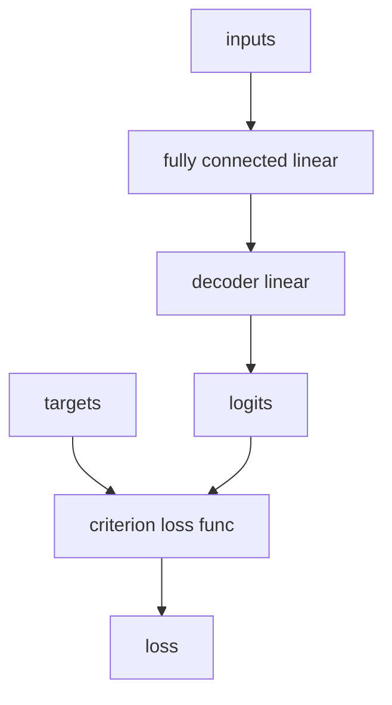

[TOC]

# Introduction to NLP with Pytorch

## Pytorch

a DL library allows user to define model, loss function and learning rate optimizer (forward-propagation)

it also allows user to define the computation graph and supports automatic differentiation (back-propagation)

pytorch utilized a dynamic computational graph

| Static                                             | Dynamnic                                             |
| -------------------------------------------------- | ---------------------------------------------------- |
| define then run                                    | define by run                                        |
| define the computational graph and feed data to it | computational graph is define on the fly             |
| easier to distribute to multiple machines          | use debugger to view dataflow and check matrix shape |
| ability to ship models independent of code         | able to handle variable sequence length              |
| complex to code and debug                          | easier to define some complex networks               |

### an example of backward propagation

```python
x = torch.randn(1, 10)
prev_h = torch.randn(1, 20)

W_h = torch.randn(20, 20)
W_x = torch.randn(20, 10)
W_h.required_grad = True
W_x.required_grad = True

i2h = torch.mm(W_x, x.t())
h2h = torch.mm(W_h, prev_h.t())

next_h = i2h + h2h
next_h = next_h.tanh()

next_h.backward(torch.ones(20, 1))
```

the graph is build line by line (ie run in jupyternb cell by cell) and everything comes together in the last line using .backward() method for backpropagation

?learning non linearity using activation functions

?universal approximation theorem

### common loss functions

for regression, we could opt for L1 or L2 loss (MSE)

for classification, we could opt for negative log likelihood or cross entropy

```python
# using a loss function with Pytorch
criterion = nn.CrossEntropyLoss()

# calculating loss of a model
loss = criterion(prediction, target)
```

### gradient descent (by default its dynamic?)

```python
loss.backward() # backward pass
optimizer.step() # update weights
```

### PyTorch Dataset Class?

```python
class MyDataset(Dataset):
    def __init__(self):
        # read your data file
        # tokenize and clean text
        # convert tokens to indices
    
    def __getitem__(self, i):
        return self.sequences[i], self.targets[i]
    
    def __len__(self):
        return len(self.sequences)
```

getitem and len is by default required by PyTorch

### Pytorch Model Definition

```python
# variables and numbers / constants -> non differentiable
class MyClassifier(nn.Module):
    def __init__(self):
        super(MyClassifier, self).__init__()
        self.fc1 = nn.Linear(128, 32) # pytorch understands linear as variables -> differentiable
        self.fc2 = nn.Linear(32, 16)
        self.fc3 = nn.Linear(16, 1)
    
    def forward(self, inputs):
        x = F.relu(self.fc1(inputs))
        x = F.relu(self.fc2(x))
        x = F.sigmoid(self.fc3(x))
        return x
model = MyClassifier().to('cuda')
```

### PyTorch Training Loop

```python
for epoch in range(n_epocchs):
    for inputs, target in loader: # loader is the dataset prepared
        # clean old gradients
        optimizer.zero_grad()
        # forward pass
        output = model(inputs)
        # calculate loss
        loss = criterion(output, target)
        # perform gradient descent with backward pass
        loss.backward()
        # update parameters
        optimizer.step()
```

## NLP basics

a few to mention including text preprocessing and integrating with PyTorch

examples of real world DL-NLP

- language comprehension, tagging (voice to text and text understanding)
- machine translation
- text generation, summarization
- Named-entity recognition (NER)
- sentiment analysis

### text preprocessing for NLP tasks

```python
# tokenize
tokenize('your line')
# remove stop words
reomove_stop_words(_)
# lemmatize eg. change past tense to present to have a higher overlapping of words
lemmatize(_)
# replace rare words eg. WordPiece 
replace_rare_words(_)

# OHE
# bags of words representation using OHE
from sklearn.feature_extraction.text import CountVectorizer
```

bags of words is a discrete representation, it would not be able to handle synonyms eg. dogs and hounds. we also would not be able to project the words into a continuous space and get the similarity between those

### bags of words feed forward network

Example 1

```python
_input = {'good': 2, 'Movie': 1, 'plot': 1}
target = 1
```



### embeddings

distributed representation of text, before embeddings NLP was treated with OHE / categorical representation. embeddings allows us to have similarity between words.

````python
# adding embedding layer in pytorch
embedding_layer = nn.Embedding(num_embeddings=vocab_size, embedding_dim=4)
ambeddings = embedding_layer('your text here'.split())
````

### word2vec

assumption: nearby words shares some semantic meaning by association

basic idea: to train a NN to predict a target word given a context word (skip-gram model)

### GloVe

t-sne

## RNNs

sequence, involves a time axis of sort.

one to one: not RNN

one to many: image captioning

many to one: sentiment classification

many to many (delayed): translation / text generation

many to many (in-sync): video classification at frame level

### vanishing gradient problem

the longer it gets, the more it forgets. the weights becomes negligible across the multiplication

### exploding gradient problem

opposite of vanishing gradient, we address this by using gradient clipping

## RNN Architectures

to address the problem mentioned above, we can change the RNN architectures from simple RNN to eg. LSTM, GRU and etc.

````python
class MyModel(nn.Module):
    def __init__(self):
        super(MyModel, self).__init__()
        self.encoder = nn.Embedding(10, 50)
        self.rnn = nn.GRU(50, 128)
        self.decoder = nn.Linear(128, 1)
    def init_hidden(self):
        return torch.randn(1, 1, 128)
   	def forward(self, input_, hidden):
        encoded = self.encoder(input_)
        output, hidden = self.rnn(encoded.unsqueeze(1), hidden)
        output = self.decoder(output.squeeze(1))
        return output, hidden
````

## Char-RNN text generation (language modeling)

## Sequence models

### seq2seq

we transform input with an encoder to a context vector then subsequently decode it into a sequence output

### seq2seq with attention

### encoder-decoder attention

attention determines which part of the input sequence are important for the decoder at certain timestep. we pass all intermediate context vector and final context vector to the decoder thus attention, or simple what is most worth your attention at this point of time?

````python
# attention score (bahdanaus 2015)
score = torch.tanh(self.W1(encoder_output) + self.W2(hidden_with_time_axis))

# attention weights
attention_weights = torch.softmax(self.V(score), dim=1)

# find the context vectors
context_vector = attention_weights * encoder_output
context_vector = torch.sum(context_vector, dim=1)
````

### Attention is all you need  (paper by google)

to ditch RNN and focus on attention

## transformers

a stack of encoders and decoders, instead of RNNs its all self attentions

````mermaid
graph TD
e[encoder] --> s1[encoder-self-attention]
s1 --> ffn1[feed-forward-network]
d[decoder] --> s2[decoder-self-attention]
s2 --> eda[encoder-decoder-attention]
eda --> ffn2[feed-forward-network]
ffn1 -->eda
````

self attention joints both queries and keys in same sequence / context, contrast to RNN where we have keys and queries separated.

### multi-head self-attention


_____

[video source](https://www.youtube.com/watch?v=4jROlXH9Nvc&list=WL&index=18&ab_channel=CodingTech)

[slides](https://docs.google.com/presentation/d/1zyuwCx7knqnP-LJswlDfWSmk5FhFgFmYJGqdEZn8yhc/edit#slide=id.g5d534672fc_0_12)

[code](https://github.com/scoutbee/pytorch-nlp-notebooks)