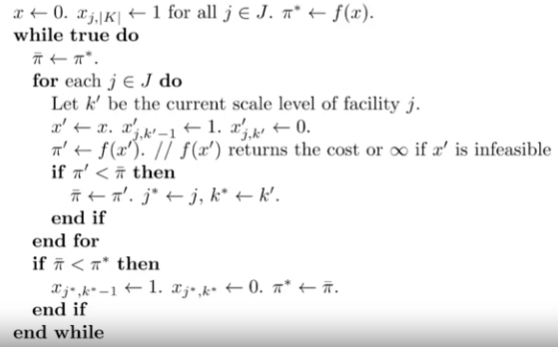

# design and evaluation of heuristic algorithms

case study: facility location with 12 facilities and ~15,000 customers. BnB
might not be realistic. use heuristic instead. a few things in mind, 

- how to formulate a heuristic algorithm?
- how to proof that it is near optimal?

## problem statement

in 2017 NEC taiwan owns 12 service facilities in taiwan with > 140 engineers
to service > 14,000 customer sites. however the after sales service costs a
lot. a simple cost breakdown includes service cost, office rent and utility
fees. among these facilities, to close down/open up facilities to tradeoff
between service costs against office rent and utility fees (operating cost)?
facility, customers and engineers are all to be considered. the environment is
dynamic i.e. more/fewer customers, frequency of travel to $x$ distance higher/
lower. a model that is able to generate suggestion when the environment changes
is ideal.

> mathematical model -> heuristic algorithm

two application (1) optimization for the current environment (2) cost
estimation when presented new business opportunities.

## modeling

> conceptual model -> mathematical model -> computer model
> conceptual model is the problem statement and usually imprecise
> mathematical model is what taught in Operation Research I and a prerequisite
> for computer model.
> computer model is a concrete program that generates solutions.

### conceptual model

decisions to make

- for each location should there be a facility?
  - if yes, what is the scale
- allocating engineers
- assign customers

with an objective function of cost minimization

- office rents
- traveling costs (service cost)
- utility costs

and the following constraints

- at most one facility built in one candidate location
- for a built facility exactly one scale level to be chosen
- a facility must be assigned to serve a customer site and get engineers
  allocated if built
- sufficient engineers should be allocated to serve assigned customers at each
  facility
- total engineers should be limited according to the facility's scale level

> from the decisions to make one can think the problem as a four dimensional
> problem.

### mathematical model

sets, indices and variables. let $I$ be the set of customers $J$ be the set of
candidate locations and $K$ be the set of scale levels. let $i\in{I}$ represent
a customer, $j\in{J}$ a facility location and $k\in{K}$ a facility scale level.

decision variables

| variable | description |
|-|-|
| $x_{kj}$ | $1$ when a facility is built at location $j$ with scale level $k$ else $0$ |
| $y_{ij}$ | $1$ if customer $i$ is served by site $j$ else $0$ |
| $w_{j}$ | number of engineers allocated at location $j$ |

parameters

| parameter | description |
|-|-|
| $f_{jk}$ | annual office rent of location $j$ of scale $k$ |
| $h_i$ | annual service needed by customer $i$ |
| $d_{ij}$ | cost per service for engineer to travel between $i$ and $j$ |
| $c_j$ | cost for hosting site $j$ |
| $m_{jk}$ | maximum number of engineers that can be hosted in facility $j$ with scale $k$ |
| $s$ | number of services that an engineer can complete in a year |
| $a_{ij}$ | $1$ if location $j$ and customer $i$ is close enough |

> decoupling of parameters? for future extensibility.

objective function

$$
\min \quad
    \sum_{j\in{J}}\sum_{k\in{K}}f_{jk}x_{jk}+
    \sum_{i\in{I}}\sum_{j\in{J}}h_id_{ij}y_{ij}+
    \sum_{j\in{J}}c_jw_j
$$

where the first group refers to office rent, second group refers to service
cost and last group engineer hosting costs.

constraint: for a built facility exactly one scale level to be chosen

$$
\sum_{k\in{K}}x_{jk}\leq{1} \quad \forall{j}\in{J}
$$

constraint: for each customer and location, only a built facility may serve the
customer

$$
y_{ij}\leq{\sum_{k\in{K}}x_{jk}} \quad \forall{i}\in{I},j\in{J}
$$

constraint: each customer must be serve by a close enough facility

$$
\sum_{j\in{J}}A_{ij}y_{ij}=1 \quad \forall{i}\in{I}
$$

constraint: number of engineers allocated cannot exceed its capacity

$$
w_j\leq{\sum_{k\in{K}}m_{jk}x_{jk}} \quad \forall{j}\in{J}
$$

constraint: number of engineers allocated to each facility should be sufficient
to complete services assigned

$$
sw_j\geq{\sum_{i\in{I}}h_iy_{ij}} \quad \forall{j}\in{J}
$$

constraint: all decision variables must be binary

$$
x_{jk}\in{\{0, 1\}} \quad \forall{j}\in{J},k\in{K}\\
y_{ij}\in{\{0, 1\}} \quad \forall{j}\in{J},i\in{I}
$$

### results and discussions

total cost savings of 7% per year.

potential detriments

- reallcation subsidies
- maintaining customer relationship
- single engineer site might not be realistic

### heuristic algorithm

MIP is good but not enough. the proposed heuristic algorithm is based on naive
greedy algorithm. start with opening all facilities at largest scale. in each
iteration, greedily attempt to improve the current solution by downsizing
exactly one facility by one scale level. if there are multiple facility's
downsizing reduces total costs, choose the one that yields largest reduction.
rinse and repeat until there is no further feasible downsizing opportunity.

> *greedy* here meant by looking at less parameters.

the evaluation process is done by evaluating the cost and feasibility i.e. by
having a way to assign customers and allocate engineers. to assign customers to
facilities,

- list all customers
- if any customer with no open facility that is close enough conclude infeasible
- else for customer $i$ assign them to closest open facility $j^*$ that has
  enough capacity (i.e. adding $h_i$ to facility does not make total number of
  assigned services exceed $sm_{j^*k}$ where $k$ is its current scale level)
- when an additional engineer is needed, add one there

#### pseudocode

#### performance evaluation

without optimal solution from mathematical model, performance evaluation might
be able to be done by having multiple algorithms to compare and contrast
against some arbitrary business goal or theoritical/hypothetical lower bound.

> data model separation; data changes but model should not.
> OR does not solve the entire problem. it solves the quantifiable part and the
> remaining are for the decision maker to think about.