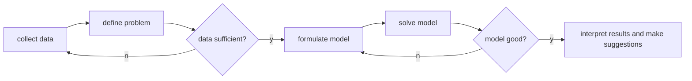

# motivation

what is management? "management is the attainment of organization **goals** in
an effective and efficient manner through planning, organizing, leading and 
controlling organizational **resources**" (Daft, 2014, p.7)

resource allocation using operations research i.e. management science, decision
science, optimization, mathematical programming.

SNOTE: two person 5 task with various amount of time needed, how to allocate
tasks to minimize total time needed?

complicating the SNOTE:

- job with precedence rules
- job cannot be done by certain workers
- job that can be splitted
- job that completion speed vary among workers

> best estimates

applications: flights scheduling, logistics delivery.

operation researachis the methodology to **allocate** the available resource to
the varous activities in a way that is most effective for the organization as a
whole. it is addresses the concern on how to conduct and coordinate the 
operations within an organization and support decision making. (introduction
to operation reserach by Hillier and Lieberman)

## business analytics

what happened + historical data = descriptive analytics
descriptive analytics + prediction model = predictive analytics
predictive analytics + decision model (OR) = prescriptive analytics 

data analytics to collect information and **understand** the problem e.g. what
may happen? a store with certain sales pattern (learnt by model) or trend,
gives the ability to forecast (dealing with probablities); operational research
to allocate resource and solve the problem.

complicating the SNOTE:

- demand substitution



model might be too abstract or unrealistic thus we need to reformulate/refine
the model. however model and analytics are not everything. it describes a
problem in a precise and concise way (between human and machine) and facilitate
the use of machine to solve the problem. however, there are problems that are
too difficult to be formulated into mathematical models and more often critical
information might be missing.

## mathematical programming

knapsack problem. bringing useful items for hicking, with a weight limitation.
what (not) to bring? how to maximize total value?

1. decision variables: what may we determine?

$$
\begin{equation}
    x_i =
    \begin{cases}
        1, & \text{if item i is chosen}\\
        0, & \text{otherwise}
    \end{cases}
\end{equation}
$$

2. objective function: what do we want?

$$
max(6x_1+5x_2+4x_3+4x_4+3x_5+4x_6+x_7)
$$

3. constraints: what are the limitations?

$$
0.5x_1+1.5x_2+0.4x_3+x_4+1.1x_5+1.6x_6+0.8x_7\leq{5}
$$

and

$$
x_i\in{\{0,1\}}\forall{i}=1,...,7
$$

### compact formulation

let $w_i$ and $v_i$ be the weight and value of item $i$; let $n$ be the number
of items and $B$ be the maximum allowable weight. a compact formulation is as
the following,

$$
\max\sum_{i=1}^{n}{v_ix_i}\\
s.t.\sum_{i=1}^{n}{w_ix_i}\leq{B}\\
x_i\in{\{0,1\}}\forall{i}=1,...,7
$$

the above compact formulation is desirable because it also applies to other
problems/scenarios e.g. deciding which order to take factoring in time vs
capacity and gross profit or deciding stock portfolio to factor in budget vs
expected return and units to maximize profit.

> note, for the stock portfolio the decision is not all-or-nothing instead it
> should be,

$$
0\leq{x_i}\leq{1}\forall{i}=1,...,n
$$

the all-or-nothing problem is known as integer program and the opposite is known
as the linear program. other problem variation includes nonlinear program.

## history

George Dantzig route planning for military aircraft by inventing the simplex
method.

```python
# knapsack problem

# simplex method - in mip/milp skipp!
```