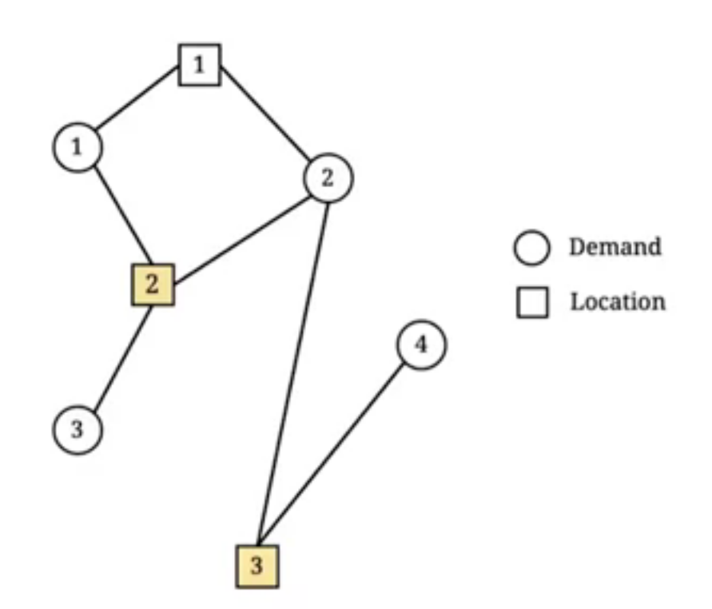

# integer programming

things are discrete here. and the problem here can be intuitively think of as
selection or assignment problem i.e. telling some entity what to do exactly
on a specific time.

- setup cost (whole units, and in scenarios where first unit is expensive and the followings are marginal)
- facility location
- machine scheduling
- vehicle routing

IP requires the variables to be only integer values. IP essentially is
referring to linear IP, NLIP is a separate discussion. here we visit the
personnel scheduling problem with IP. using LP to solve for scenario where
staff number is small can be a problem when rounding is applied. when the scale
is large i.e. staff of thousands, rounding up or down does not significanty
affect productivity, however 3.8 and 4.2 kind of values does. another example
is on route selection. think the problem as a graph, give each edge a binary
variable 1 if included else 0. constraints are required to ensure edges are
forming a route. in this case using LP also dont make sense as the value has to
be 1 or 0.

## Integer programming formulation

### knapsack problem

| item | 1 | 2 | 3 | 4 |
|------|---|---|---|---|
| value | 16 | 22 | 12 | 8 |
| weight | 5 | 7 | 4 | 3 |

the knapsack capacity is 10kg and the formulation is,

$$
\begin{align*}
\max 16x_1+22x_2+12x_3+8x_4\\
s.t. \quad 5x_1+7x_2+4x_3+3x_4\leq{10}\\
x_i\in{\{0,1\}} \quad \forall{i}=1,...,4
\end{align*}
$$

IP allow implementation of selection rules.

#### At least or at most

variables: at least one among item 2, 3, 4

$$
x_2+x_3+x_4\geq{1}
$$

variables: at most two among item 1, 3, 4

$$
x_1+x_3+x_4\leq{2}
$$

constraints: satisfying one of two constraints $g_1(x)\leq{b_1}\text{ and }g_2(x)\leq{b2}$
by defining,

$$
z=\begin{cases}
0 & \text{if } g_1(x)\leq{b_1} \text{ is satisfied,}\\
1 & \text{if } g_2(x)\leq{b_2} \text{ is satisfied}
\end{cases}
$$

with $M_1$ being an upper bound of each LHS the following two constraints
implement what is needed,

$$
g_1(x)-b_1\leq{M_1z}\\
g_2(x)-b_2\leq{M_2(1-z)}
$$

by introducing $M_i$ and having $g_1(x)-b_1\leq{M_1z}$ satisfied, $g_2(x)$ is
flexible.

constraints: at least two of the three constraints

$$
z_i=\begin{cases}
1 & \text{if } g_i(x)\leq{b_i} \text{ is satisfied,}\\
0 & \text{if } g_i(x)\leq{b_i} \text{ may be satisfied}
\end{cases}
$$

with $M_i$ being an upper bound of each LHS the following two constraints
implement what is needed,

$$
g_i(x)-b_i\leq{M_i(1-z)} \quad \forall{i}=1,2,3\\
z_1+z_2+z_3\geq{2}
$$

#### Or

select item 2 or 3

$$
x_2+x_3\geq{1}
$$

select item 2; otherwise item 3 and 4 together

$$
2x_2+x_3+x_4\geq{2}
$$

> question: why isnt leq?
leq means that empty set is also a solution.
> question: why condition are not "two-way"?

> depending on the condition (business need clarification), $\leq$, $\geq$
> and $=$ is used.

#### if-else

if item 2 is selected; select item 3

$$
x_2\leq{x_3}
$$

if item 1 is selected; do not select item 3 and 4

$$
2(1-x_1)\geq{x_3+x_4}
$$

### Fixed-charge constraints

there exists $n$ factories, 1 market and 1 product. $K_i$ is the capacity of
factory $i$. $C_i$ is the unit production cost at factory $i$. $D$ is the
demand of the product. goal is to minimize cost. however there is also a setup
cost at factory $i$: $S_i$, which is a one off payment as long as any **positive**
amount of products is produced.

let the decision variables be,

- $x_i$ production quantity at factory $i=1,...,n$
- $y_i=\begin{cases}1&\text{if product is produced at factory }i\\0\end{cases}$

objective function:

$$
\min \sum_{i=1}^{n}{C_ix_i}+\sum_{i=1}^{n}{S_iy_i}
$$

capacity limitation:

$$
x_i\leq{K_i} \quad \forall{i}=i,...,n
$$

demand fulfillment:

$$
\sum_{i=1}^{n}{x_i}\geq{D}
$$

noticed that there is no connection between $x$ and $y$ thus,

$$
x_i\leq{K_iy_i} \quad \forall{i}=i,...,n
$$

- if $x_i\gt{0}$, $y_i$ cannot be $0$
- if $x_i=0$, $y_i$ can be $0$ or $1$ however solver will always return 0 because this is a minimize function

above is known as a fixed-charge constraint, the general form is $x\leq{My}$
where both $x$ and $y$ are decision variables and $y$ is determined by $x$, $M$
is an upper bound of $x$. when $x$ is binary $x\leq{y}$ is sufficient.

> selecting upper bound should handled with care. in the example capacity was
> chosen, given if y = 1 it does not reduce the feasible region. alternatively
> if there is no capacity limitation, D is used as no reason to produce beyond
> demand.

binary and nonnegative constraints:

$$
x_i\geq{0},y_i\in{\{0,1\}}\quad \forall{i}=1,...,n
$$

## Facility Location

to answer question e.g. "where to build the facilities?" or "where to locate
the scarce resource?". to describe it generally, it solves the problem on how
to allocate a subset of entities from a set of finite entities with a limited
amount of resource. in general there are some demand nodes and some potential
locations. facility location problem are typically categoriezd based on their
objective functions. three facility location problem is covered,

- set covering problems: build a minumum no. of facilities to cover all demands
- maximum covering problems: build a given no. of facilities to cover as many demand as possible
- fixed charge location problems: find a balance between benefit of covering demands and cost of building

### set covering

consider a set of demands $I$ and a set of locations $J$. the traveling time
between demand $i$ and location $j$ is $d_{ij}\gt{0},i\in{I},j\in{J}$. a
service level of $s\gt{0}$ is given. demand $i$ is said to be covered by
location $j$ if $d_{ij}\lt{s}$. how to allocate as few facilities as possible
for the demand $I$?

> note that there can be a $d_{ij}$ between 1 adn 4 however it is greater than
> $s$ thus it is not showed/simplified

$d_{ij}$ is not critical in the sense that as long as it satisfy $s$ it is
qualified. thus using $a_{ij}=1$ to represent if $d_{ij}\lt{s}$ or $0$
otherwise, $i\in{I},j\in{J}$. let $x_j=1$ if a facility is build on location $j$
or $0$ otherwise.

$$
\begin{align*}
\min \sum_{j\in{J}}{x_j}\\
s.t. \quad \sum_{j\in{J}}{a_{ij}x_j}\geq{1} \quad \forall{i}\in{I}\\
x_j\in{0,1} \quad \forall{j}\in{J}
\end{align*}
$$

> shouldnt it be $\sum_{j\in{J}}{a_{ij}x_j}\geq{I}$ or total demand?

the weighted version $\min \sum_{j\in{J}}{w_jx_j}$. weight can be e.g. cost and
etc.

### maximum covering

similar to set covering with additional constraint to only build **at most** $p\in{\mathbb{N}}$
facilities. in addition to the decision variable $x_j$, a new decision variable
$y_i=1$ is introduced if demand $i\in{I}$ is covered by any facility or $0$
otherwise.

$$
\begin{align*}
\max \sum_{i\in{I}}{y_i}\\
s.t. \quad \sum_{j\in{J}}{a_{ij}x_j}\geq{y_i} \quad \forall{i}\in{I}\\
\sum_{j\in{J}}{x_j}\leq{p}\\
x_j\in{\{0,1\}} \quad \forall{j}\in{J}\\
y_i\in{\{0,1\}} \quad \forall{i}\in{I}
\end{align*}
$$

### fixed charge location

consider a set of demands $I$ and a set of locations $J$. at demand $i$, the
demands size is $h_i\gt{0}$. the unit shipping cost from location $j$ to demand
$i$ is $d_{ij}\gt{0}$. the fixed construction cost at location $j$ is $f_j\gt{0}$
. how to allocate some facilities to minimize the total shipping and
construction costs? there are two sub questions:

1. where to allocate the facilities
2. how to assign them to customers

$x_j=1$ if facility is build at location $j\in{J}$ or $0$ otherwise. $y_{ij}=1$
if demand $i\in{I}$ is served by facility at location $j\in{J}$ or $0$
otherwise.

$$
\begin{align*}
\min \sum_{i\in{I}}\sum_{j\in{J}}{h_id_{ij}y_{ij}}+\sum_{j\in{J}}{f_jx_j}\\
s.t. \quad y_{ij}\leq{x_j} \quad \forall{i}\in{I},\forall{j}\in{J}\\
\sum_{j\in{J}}{y_{ij}}=1 \quad \forall{i}\in{I}\\
x_j\in{\{0,1\}} \quad \forall{j}\in{J}\\
y_i\in{\{0,1\}} \quad \forall{i}\in{I}
\end{align*}
$$

what is shown is a **uncapacitated** scenario. a facility can server any amount
of demand. if there is a capacity constraint of $K_j\gt{0}$ it is added as such
$\sum_{i\in{I}}{h_iy_{ij}}\leq{K_j} \quad \forall{j}\in{J}$. capacitated
scenario is known as CFL and the uncapacitated scenario is known as UFL.

### getting around with the problems type

set covering is where it is required to take care of all parties/stakeholders.
max covering is where budgets are limited. fixed charge location is when
service costs depends on distance.

## machine scheduling

jobs to be assigned to some entity. consider a factory producing one product
for $n$ customers. in a serial production scenario one job is run at a time 
with each has a due date, how to schedule $n$ jobs to minimize total delayed
jobs? splitting jobs is not helpful and there is always $n!$ ways to sequence $n$
jobs. there can be a few patterns,

> in some cases, scheduling is essentially sequencing.

- single machine serial production
- multiple machine
  - parallel production: only one processing step
  - flow shop problem: few steps and each machine can run one processing step
  - job shop problem: multiple steps/machine is allowed to mix and match

- job splitting
  - preemptive problem: process can be interupted and resumed
  - non-preemptive problem

- performance measurement
  - makespan (time all job completed)
  - (weighted) total completion time
  - (weighted) number of delayed jobs
  - (weighted) total lateness
  - (weighted) total tardiness
  - etc.

> if a job completed before due its considered -ve lateness but 0 tardiness

### completion time minimization (single machine)

consider scheduling $n$ jobs on a single machine. job $j\in{J}={\{1,2,...,n\}}$
has processing time $p_j$. different schedules give these jobs different
completion times. the completion time of job $j$ is denoted as $x_j$ (decision
variable). the machine can process only on job at a time. goal is to schedule
all the jobs to minimize the total completion time $\sum_{j\in{J}}{x_j}$

supposed jobs are scheduled job in $1,2,...,n$ order yields  $x_1=p_1, x_2=p_1+p_2$
and $x_n=\sum_{i=1}^{n}{p_i}$. **gantt chart** can help illustrating a schedule
. job splitting does not help such problem given a job eventually has to be
processed on the same machine. if job 2 can only be started after job 1 by
having $x_2\geq{x_1+p_2}$ as constraint, how to generalize?

in a feasible schedule, job $i$ is either before or after job $j$ for all $i\neq{j}$
therefore at least one of the two constraints listed must be followed,

- $x_j\geq{x_i+p_j}$
- $x_i\geq{x_j+p_i}$

$z_{ij}=1$ is job $j$ is before job $i$ or $0$ otherwise. thus constraints
needed,

$$
x_i+p_j-x_j\leq{Mz_{ij}}\\
x_j+p_i-x_i\leq{M(1-z_{ij})}
$$

what value $M$ should take? using $x_i+p_j-x_j\leq{x_i+p_j}\leq{\sum_{j\in{J}}{p_j}}+p_j$
and $(\sum_{j\in{J}}{p_j}+p_j)z_{ij}$ is a good enough upper bound. what about
$M=\sum_{j\in{J}}{p_j}$?

complete formulation

$$
\begin{align*}
\min \sum_{j\in{J}{x_j}}\\
s.t. \quad x_i+p_j-x_j\leq{M}z_{ij} \quad \forall{i\in{J}},j\in{J},i\lt{j}\\
x_i+p_j-x_j\leq{M}(1-z_{ij}) \quad \forall{i\in{J}},j\in{J},i\lt{j}\\
x_j\geq{p_j} \quad \forall{j\in{J}}\\
x_j\geq{0} \quad \forall{j\in{J}}\\
z_{ij}\in{\{ 0,1\}}\quad \forall{i\in{J}},j\in{J},i\lt{j}
\end{align*}
$$

why $x_j\geq{p_j} \quad \forall{j\in{J}}$ is needed? if such constraint does
not exists, jobs will be all set to time $0$.

by introducing release time, the problem gets even harder. release time is
basically $R_j$ where $R_j\gt{p_j}$. how to add it to the formulation above?

### minimizing makespan on on parallel machines

consider scheduling $n$ jobs on $m$ **parallel** machines. job $j\in{J}=\{1,2,...,n\}$
has processing time $p_j$. jobs can be processed at any machine however it can
only be processed only on one machine. this yields different completion times
by scheduling differently. the makespan of a schedule is the maximum completion
time i.e. of all machine the one that takes the longest to finish processing.

- as long as some set of jobs are assigned to a machine, the sequence does not matter
- the problem of minimizing makespan is just assigning jobs to machines
- let $x_{ij}=1$ if job $j\in{J}$ is assigned to machine $i\in{I}$ or $0$ otherwise.
- on machine $i\in{I}$ the last job is completed at $\sum_{j\in{J}{p_jx_{ij}}}$
- the makespan $w$ is the maximum completion time among all machine $w\geq{\sum_{j\in{J}}{p_jx_{ij}}},\forall{i\in{I}}$

$$
\begin{align*}
\min w\\
s.t. \quad w\geq{\sum_{j\in{J}}{p_jx_{ij}}},\forall{i\in{I}}\\
\sum_{i\in{I}x_{ij}}=1 \quad \forall{j\in{J}}\\
x_{ij}\in{\{0,1\}} \quad \forall{i\in{I},j\in{J}}
\end{align*}
$$

how to ensure that $w$ is indeed the makespan? i.e. if $\{50,80,90\}$ are
makespan of machine $i,j,k$, $100$ also satisfies the constraint. this is
actually not true as the objective here is to minimize $w$.

## traveling salesperson/vehicle routing

addressing the problem on what is the most efficient way to travel across all
points. the shortest distance between any two points is known. capacity of
goods is assumed always ample for traveling salesperson problem however its a
special case for the more general vehicle routing problem where capacity might
be insufficient. there is always $n!$ feasible routes, but the goal is to
find the shortest route. to formulate TSP into an interger program, consider a
directed complete network $G=(V,E)$ where there are $n$ nodes and $n(n-1)$
edges. the edge weight for edge $(i,j)$ is $d_{ij}\gt{0}$. some edges are
selected to form a tour. a tour is a subset of edges that form a cycle passing
of all nodes. $x_{ij}=1$ if edge $(i,j)\in{E}$ is selected or 0 otherwise. the
objective is to $\min \sum_{(i,j)\in{E}}{d_{ij}x_{ij}}$.

> the edges are directed i.e. a to b and b to a is two separate edge

how to ensure routing requirement? is $\sum_{(i,j)\in{E}}{x_{ij}}=n$ enough?
its not. instead for node $k\in{V}$ only select on incoming edge $\sum_{i\in{V},i\neq{k}}{x_{ik}}=1$ and one
outgoing edge $\sum_{i\in{V},j\neq{k}}{x_{kj}}=1$. now each node is on a cycle however this still does not
prevent subtours.

incomplete formulation

$$
\begin{align*}
\min \sum_{(i,j)\in{E}}{d_{ij}x_{ij}}\\
s.t. \sum_{i\in{V},i\neq{k}}{x_{ik}}=1 \quad \forall{k}\in{V}\\
\sum_{j\in{V},j\neq{k}}{x_{kj}}=1 \quad \forall{k}\in{V}\\
x_{ij}\in{\{0,1\}} \quad \forall{(i,j)}\in{E}
\end{align*}
$$

### subtour elimination

#### approach 1
for each subset of nodes with at least two nodes, the
maximum number of edges are selected is limited to $\sum_{i\in{S},j\in{S},i\neq{j}}{x_{ij}\leq{|S|-1}} \forall{S}\subsetneq{V},|S|\geq{2}$
given $n$ nodes, $2^{n}-n-2$ constraints where $2^n$ ways to choose a subset,
$n$ ways to choose a subset of one node and $2$ ways to choose a subset of zero
or $n$ nodes.

#### approach 2

let $u_i$ represent the order of passing nodes where $u_i=k$ if node $i$ is
the $k$th node to be passed in a tour.

$$
\begin{align*}
u_1=1\\
2\leq{u_i}\leq{n} \quad \forall{i\in{V}}\setminus\{1\}\\
u_i-u_j+1\leq{(n-1)(1-x_{ij})} \quad \forall{(i,j)\in{E}},i\neq{1},j\neq{1}
\end{align*}
$$

if $x_{ij}=0$ there is no constraint for $u_i$ and $u_j$ otherwise $u_j$ must
be larger than $u_i$ by at least $1$. if a tour does not contain node $1$, the
last constraint pushes those $u_i$ to infinity and violates constrain 2. when
there is $n$ nodes, $n$ additional variables and $n+(n-1)(n-2)$ constraints are
imposed.

> approach 2's number of constraints is polynomial (less) as compared to
> approach 1 where its exponential; however most likely the solver will take
> less time to compute approach 1

> by adding approach 1 or 2 it completes the formulation

## assignments

### q1

A manufacturer can sell product 1 at a price of $5 per unit and product 2 at
price of $7 per unit. Nine units of raw material are needed to manufacture one
unit of product 1, and seven units of raw material are needed to manufacture
one unit of product 2. A total of 120 units of raw material are available.
The setup costs for producing products 1 and 2 are $30 and $40, respectively. 

let $x_i$ be the sales quantity of product $i$ and $w_i$ to be $0$ if $x_i=0$
otherwise $1$ if $x_i\gt{0}$ to be the decision variables, the complete
formulation is

$$
\begin{align*}
\max 5x_1-30w_1+7x_2-40w_2\\
s.t. \quad 9x_1+7x_2\leq{120}\\
x_1\leq{(120/9)}w_1\\
x_2\leq{(120/7)}w_2\\
x_i\geq{0} \quad \forall{i}=1,2\\
w_i\in{C} \quad \forall{i}=1,2
\end{align*}
$$

### q2

Following from the above problem, suppose that now when both products are
produced for positive amounts, there is a saving of $20 in the setup cost (i.e.
in total only $50 must be paid to set up the production processes). If the 
objective function is modified to $\max 5x_1-30w_1+7x_2-40w_2+20z$ where z is a
newly added decision variable, which of the following constraints should be
added to make the formulation work? Check all correct answers.

- [x] $z\leq{w_1}$ and $z\leq{w_2}$
- [ ] $z\leq{w_1+w_2}$
- [x] $2z\leq{w_1+w_2}$
- [ ] $z\geq{w_1}$ and $z\geq{w_2}$
- [ ] $2z\geq{w_1+w_2}$

### q3

consider the following IP where $M1$ and $M2$ are parameters and $x_1,x_2,z$
are variables. the binary variables $z$ is to select at least one constraint to
be satisfied. to make the program work correctly what is the minimum possible
values of $M1$ and $M2$ that can enable $z$ to do the at-least-one selection?

- $M1=24$
- $M2=22$

### q4

Ten jobs should be scheduled on one single machine. The processing time for
these jobs are 6, 9, 3, 5, 10, 6, 3, 9, 7, and 10 (in hours). The due time for
these jobs are 50, 53, 55, 56, 59, 60, 62, 67, 68, and 70 (in hours). We want
to schedule the jobs to minimize total tardiness, which is the completion time
minus the due time if positive or zero otherwise. To formulate the scheduling
problem as an integer program, let processing time and due time of job $j$ to
be $p_j$ and $d_j$ respectively. the decision variables include $C_j$ the
completion time job $j,j\in{J}$, $T_j$ tardiness of job $j,j\in{J}$ and $z_{ij}$
$1$ if job $j$ is schedules before $i$ otherwise $0$ where $i\in{I},j\in{J},i\lt{j}$
finally let $M=\sum_{j\in{J}}{p_j}$ be large enough number. an in complete IP
that has potential to minimize the total tardiness is

$$
\begin{align*}
\min \sum_{j\in{J}}{T_j}\\
s.t. \quad T_j\geq{C_j-d_j} \quad \forall{j\in{J}}\\
C_i+p_j-C_j\leq{M}z_{ij} \quad \forall{i\in{J}},j\in{J},i\lt{j}\\
T_j,C_j\geq{0}\\
z_{ij}\in{\{0,1\}} \quad \forall{i}\in{J},j\in{J},i\lt{j}
\end{align*}
$$

which of the following to be added to make it complete?

- [ ] $C_j+p_i-C_i\leq{M}z_{ij} \quad \forall{i}\in{J},j\in{J},i\lt{j}$ 
- [x] $C_j+p_i-C_i\leq{M}(1-z_{ij}) \quad \forall{i}\in{J},j\in{J},i\lt{j}$
- [ ] $C_j+p_i-C_i\geq{M}z_{ij} \quad \forall{i}\in{J},j\in{J},i\lt{j}$
- [ ] $C_j+p_i-C_i\geq{M}(1-z_{ij}) \quad \forall{i}\in{J},j\in{J},i\lt{j}$
- [ ] all of above

### q5

Following from the above problem, suppose that two precedence rules must be
followed: Job 1 must be finished before job 5 can start, and job 5 or job 6
must be finished before job 7 can start. Which of the following constraints
should be added into the above program to ensure the precedence rules are
satisfied?

- [ ] $z_{15}=1$ and $z_{57}+z_{67}\leq{1}$
- [ ] $z_{15}=1$ and $z_{57}+z_{67}\geq{1}$
- [x] $z_{15}=0$ and $z_{57}+z_{67}\leq{1}$
- [ ] $z_{15}=0$ and $z_{57}+z_{67}\geq{1}$
- [ ] none of the above

## quick-note

- the lego production line problem i.e. how many parts to produce to minimize duplicated pieces?
- past 50 years stock price, what is an optimal set of stocks to pick (a slider to see how things has changed)
